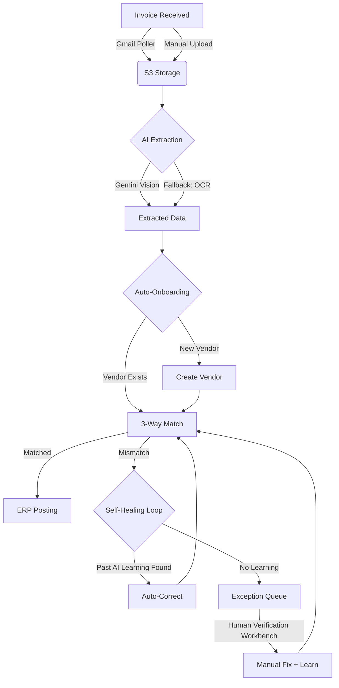
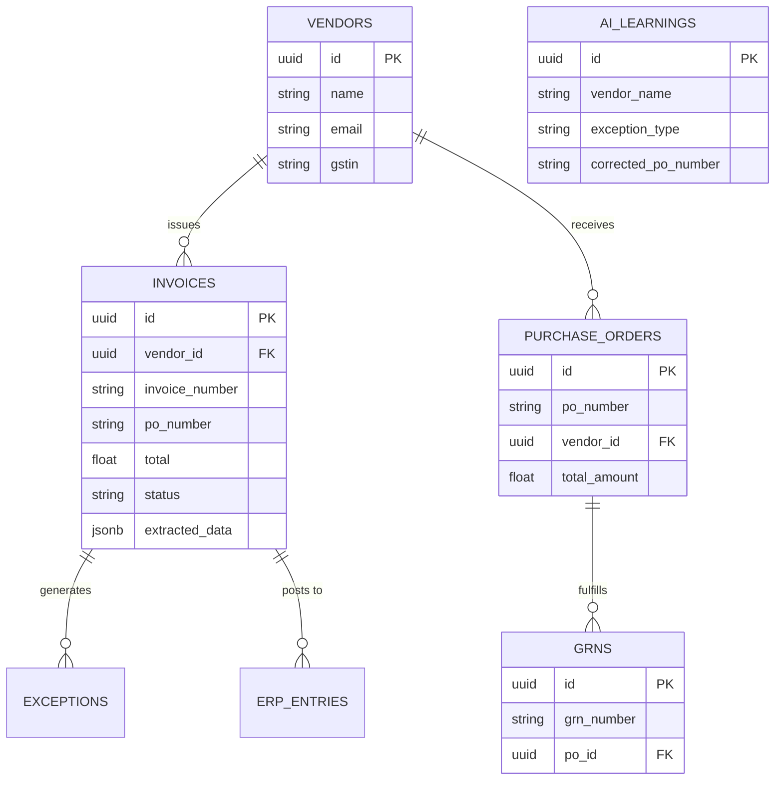

# AI Invoice Processing Agent 🤖💸

A production-ready, highly resilient AI-driven accounts payable automation system. It handles the entire invoice lifecycle from ingestion to ERP posting with "Human-in-the-Loop" AI learning.

## 🚀 Key Features & Automation

### 1. Bulletproof Extraction Pipeline
- **Multi-Model Cascade**: Orchestrates 42+ combinations of Gemini models (Pro, Flash, Lite, etc.) across multiple API versions and keys.
- **Local OCR Fallback**: Integrated `pdfplumber` and `pytesseract` as an offline safety net. If AI APIs fail, the system still extracts data with 70%+ accuracy.
- **Multi-Currency Support**: Automatic detection and formatting for INR, USD, GBP, and EUR.

### 2. Intelligent Verification Workbench
- **Side-by-Side UI**: Real-time document preview paired with an editable metadata form for lightning-fast manual verification.
- **Auto-Vendor Onboarding**: Automatically detects new suppliers via Name, Email, and GSTIN/Tax ID. If a vendor doesn't exist, it's created on the fly.
- **3-Way Matching**: Automated reconciliation between Invoice, Purchase Order (PO), and Goods Receipt Note (GRN).

### 3. "AI Learn" Exception Engine
- **Pattern-Based Learning**: When a human corrects an invoice error, the system "learns" the pattern.
- **Self-Healing Pipeline**: Future invoices with similar discrepancies (e.g., specific vendor tax quirks) are automatically corrected using stored AI learnings.

### 4. Enterprise-Grade Ingestion
- **Gmail Integration**: Auto-polls and extracts invoices from email attachments.
- **Bulk Upload**: High-speed processing for manual document uploads.
- **Real-time Notifications**: Instant alerts for processing exceptions or high-value invoice approvals.

### 🔐 Authentication & Google SSO
The application is protected by **Supabase Auth**. To enable Google Login:
1. Go to your [Supabase Dashboard](https://supabase.com/dashboard).
2. Navigate to **Authentication > Providers** and enable **Google**.
3. Input your `Client ID` and `Client Secret` from the Google Cloud Console.
4. Add the Supabase callback URL (provided in the Supabase dashboard) to your Google Cloud Console **Authorized redirect URIs**.
5. Users can also access a **Guest Demo Mode** which allows instant access to the dashboard without a Google account for evaluation.

### Gmail Integration Setup
To enable automated email polling:
1. Go to [Google Cloud Console](https://console.cloud.google.com/).
2. Enable the **Gmail API**.
3. Go to **APIs & Services > Credentials** and create an **OAuth 2.0 Client ID** (Type: Web Application).
4. Add these **Authorized redirect URIs**:
   - `http://localhost:8000/api/gmail/callback` (Local)
   - `https://your-vercel-domain.vercel.app/api/gmail/callback` (Production)
5. Set these variables in your `.env` or Vercel:
   - `GMAIL_CLIENT_ID`
   - `GMAIL_CLIENT_SECRET`
   - `GMAIL_REDIRECT_URI` (must match the whitelisted one)

## 🔄 System Architecture & Automated Workflow
The system operates on a highly automated, self-healing pipeline. Here is the step-by-step lifecycle of an invoice:

1. **Ingestion (The Trigger)**:
   - Invoices enter via manual PDF/Image upload or automatically through the Gmail Polling service.
   - The raw document is uploaded to Supabase S3 storage, and an `invoice` record is created in `processing` status.
2. **AI Extraction & Auto-Onboarding**:
   - The file is sent to the Gemini Vision API. If the API fails or rate-limits, the system automatically falls back to a local OCR engine (`tesseract`/`pdfplumber`).
   - The engine extracts monetary values, PO numbers, and vendor details (Name, Email, GSTIN, Currency).
   - **Auto-Onboarding**: The system checks if the extracted `vendor_name` or `GSTIN` exists. If not, a new supplier is automatically created and linked.
3. **The Matching Engine & Self-Healing Loop**:
   - The system attempts a **3-Way Match** (Invoice -> Purchase Order -> GRN).
   - **Self-Healing**: If a PO is not found or an amount variance occurs, the engine checks the `ai_learnings` database. If a human previously corrected this specific vendor's quirk (e.g., mapping a missing PO to a default one), the AI automatically applies the correction.
4. **Verification Workbench (Human-in-the-Loop)**:
   - If an invoice cannot be auto-matched, it is flagged as an `exception`.
   - The AP clerk uses the **Side-by-Side Verification Workbench** to compare the extracted data against the raw PDF.
   - When the clerk makes a correction (e.g., fixing a wrong PO number) and clicks "Save & Match" with *AI Learning* enabled, the system stores this correction pattern in the `ai_learnings` table.
5. **ERP Posting**:
   - Once fully matched, a journal entry is automatically generated in the `erp_entries` table, debiting Expense and crediting Accounts Payable.

### 📊 User Flow & System Pipeline


### 🗄️ Entity Relationship Diagram (ERD)


## 🛠 Tech Stack
- **Frontend**: Next.js 15 (App Router), Tailwind CSS 4, TanStack Query, Framer Motion.
- **Backend**: FastAPI, Python 3.10+.
- **Database/Storage**: Supabase (PostgreSQL + S3 Storage).
- **AI/ML**: Google Gemini Pro/Flash, Tesseract OCR.

## 📦 Setup & Deployment

### Environment Variables
Create a `.env` in the root:
```env
# Supabase
NEXT_PUBLIC_SUPABASE_URL=...
NEXT_PUBLIC_SUPABASE_ANON_KEY=...
SUPABASE_SERVICE_ROLE_KEY=...

# AI Keys
GEMINI_API_KEY=...
GEMINI_API_KEY_BACKUP=... # Optional fallback key
```

### Installation
```bash
# Backend
cd backend
pip install -r requirements.txt
uvicorn main:app --reload

# Frontend
cd frontend
npm install
npm run dev
```

## 📈 Roadmap
- [x] Resilient AI Pipeline
- [x] Side-by-Side Verification Workbench
- [x] AI Learning from Human Corrections
- [x] Auto-Vendor Onboarding
- [ ] Multi-tenant RLS Policies
- [ ] Advanced Fuzzy Matching for Line Items

## 👨‍💻 Developer
Developed with ❤️ by [Dr. Dhaval Trivedi](https://drdhaval.in)

🔗 **GitHub Profile:** [drdhavaltrivedi](https://github.com/drdhavaltrivedi)
